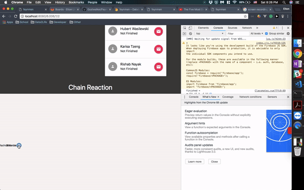

# Feynman

The Feynman Project is under active development. Here are the [milestones](https://gitlab.com/Gustwalker/Feynman/milestones)

  

[1-minute video explanation](https://www.youtube.com/watch?v=zsbHQWGIQ9Q)

Feynman is a website where students can p-set more quickly and enjoyably. 

1) It has visual explanations created by students to complement the rigor of school material. 
2) It centralizes and curates important information from Stellar, Piazza, Edx and Csail into one place.
3) Students learn through the Feynman technique. Everyone learns through teaching each other.

# Our Beliefs

1) Subpar material must never persist for more than one class generation. 

2) If you can't explain something simply, you don't understand it.

3) [The best helper is not a TA, professor nor genius - but an articulate student who's had an eureka moment.](./doc/best_helper.md)

4) Academic knowledge must be completely open-source. 

5) The only reason you're at MIT is to be able to learn with companions.  

6) Explanations must be visual and animated whenever possible.

7) Education must be 'result dependent' but 'method independent'. 

8) Never abandon a friend. Else, you tilt the world slightly towards evil rather than good. 

# How You Can Help 

We'd like visual, intuitive explanations to flourish at MIT. If you found parts of the curriculum to be weak, consider contributing to Feynman's collection of student explanations. 

For curious developers, visit the [contributing guide](CONTRIBUTING.md). It's what separates the men from the boys (or the ladies from the girls) 

[Frequently Asked Questions](FAQ.md)
